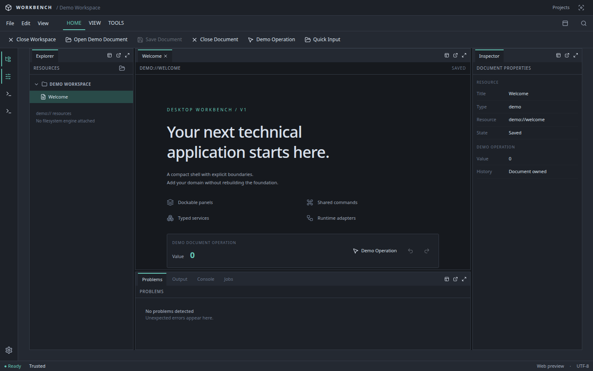
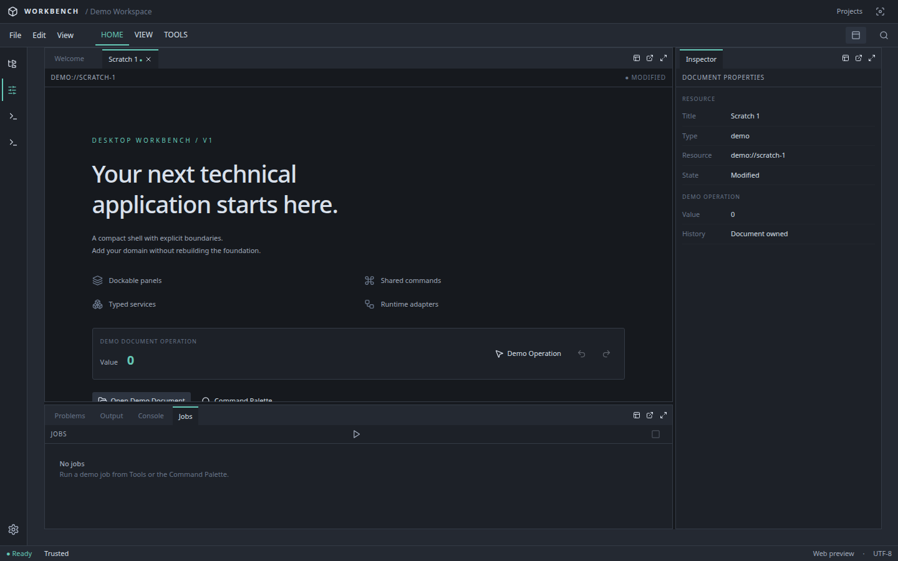

# Desktop Workbench

Reusable desktop foundation for technical applications. React 19 + TypeScript own presentation and Workbench services; Wails 3 + Go own the desktop host, persistence and jobs. No domain engine is bundled.

## Screenshots



_Initial workspace in the browser preview fixture: Explorer, Welcome document, Inspector, Problems panel._



_Same shell after the demo flow and a reload: slim ribbon, collapsed Explorer, `Scratch 1` restored as modified._

Both captures come from `task web` at `http://127.0.0.1:5173/?preview=1` and are rewritten by `task e2e`. They are browser-fixture renders, not native GTK/WebKit window captures; see [acceptance](docs/ACCEPTANCE.md) for the native validation limit.

## Start

Install Go **1.26.1**, Bun **1.3.10**, Task **3.45.4**, and Wails **v3.0.0-beta.27**:

```sh
go install github.com/go-task/task/v3/cmd/task@v3.45.4
go install github.com/wailsapp/wails/v3/cmd/wails3@v3.0.0-beta.27
task install
bunx --no-install playwright install chromium
task dev
```

Linux GTK3 builds need a working desktop D-Bus session and `pkg-config`, `libgtk-3-dev`, `libwebkit2gtk-4.1-dev`, `build-essential`, `dbus-x11`. On macOS/Windows use the native Wails prerequisites. See [development](docs/DEVELOPMENT.md).

```sh
task verify
```

For the explicit browser preview: `task web`, then open `http://127.0.0.1:5173/?preview=1`. This uses a named browser fixture with localStorage; production desktop always calls Go. It never silently falls back on a failed desktop connection.

## Demo

Open/close demo documents, move/pin/float/popout panels, collapse sidebars to overlay borders, switch Ribbon modes, use the Command Palette, run/cancel/fail a demo job, undo/redo an operation, reset the layout and restart to restore the workspace.

- `Mod+O`: open demo document
- `Mod+S`: save document
- `Mod+W`: close document (dirty documents ask before discard)
- `Mod+B`: toggle Explorer
- `Mod+Shift+P`: Command Palette
- `Mod+Z` / `Mod+Shift+Z`: document undo/redo
- `Mod+Shift+J`: start job
- `Mod+Shift+F`: focus mode

Mod means Ctrl on Linux/Windows and Cmd on macOS. Ribbon Home/View/Tools, menu, context menu, keyboard and palette dispatch the same Command IDs.

[Architecture](docs/ARCHITECTURE.md) · [Workbench](docs/WORKBENCH.md) · [Runtime](docs/RUNTIME.md) · [Development](docs/DEVELOPMENT.md) · [Acceptance](docs/ACCEPTANCE.md)

Mandatory boilerplate dependencies must remain open source and commercially usable without paid runtime or developer licences.

The v1 architecture is frozen. Change infrastructure only in response to a demonstrated friction in a real product. Start product-specific work in `frontend/src/features/<feature>/` and `internal/app/<feature>/` when needed; no empty feature folders or extension framework are included.
