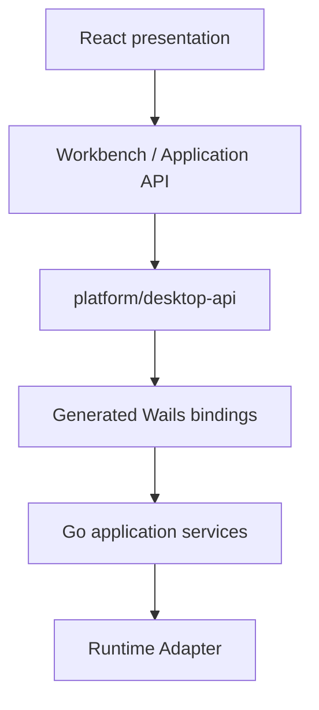

# Architecture

Modular monolith with explicit owners and manual composition. There is no internal HTTP service, universal global store, plugin host, event bus, DI framework, MCP or domain engine.

| Responsibility | Owner | Boundary |
|---|---|---|
| Navigation | TanStack Router | `/`, `/projects`, `/workspace/$workspaceId`, `/settings`, `/about` |
| Layout | Selected shell adapter implementing LayoutPort | Workbench: LayoutService + DockingLayout/FlexLayout; Minimal: explicit regions + MinimalLayout |
| Commands | CommandRegistry | Stable IDs, conditions checked again on execute |
| Context | ContextKeyService | Small predicate functions; no expression parser |
| Documents | DocumentService | IDs independent of URI and docking nodes |
| Workspace | WorkspaceService | Identity/trust; composes documents and layout for persistence |
| Document history | HistoryService per document | Do/undo/redo operations, not command replay |
| Layout history | Selected layout adapter | Separate bounded snapshots; independent of document history |
| Jobs | Go JobService | Frontend JobService polls typed snapshots every 150 ms |
| User settings | Typed observable + Go Settings / frontend density preference | Separate versioned settings record |
| Diagnostics | Go Diagnostics + frontend capture | Bounded snapshot of 100 entries |
| Native shell | DesktopShell + main.go | Window close handshake, menus, single instance |
| External engine | Go Runtime Adapter | Mock only; no external process bundled |

`main.tsx` selects the static presentation preset; `app/bootstrap/application.ts` composes service lifetimes using a shell-neutral LayoutPort. Application never imports a concrete shell. See [PRESENTATION.md](PRESENTATION.md). `register-commands.ts` registers actions; React only presents them. Application services do not import React. The shared `ObservableValue` is a subscription primitive; each service owns an independent value.

`frontend/bindings` is generated by the exact Wails CLI. Only `platform/desktop-api` imports these bindings or `@wailsio/runtime`. Features must consume application interfaces, never raw platform bindings or FlexLayout models. The layout model is private infrastructure for its adapter; it is not a feature API.

Go packages below `internal/app`, `internal/runtime` and `internal/persistence` are independent of Wails/React. `internal/platform` binds them to the host. A future CLI/headless/MCP entry point may call these application services directly; none is implemented.

`task lint` enforces frontend imports, shared-layer direction and exact npm versions. Generated files are excluded from lint. Go compiler/package visibility and `go vet` enforce backend contracts.

## Persisted records

- `settings/user.json`: theme, Ribbon mode, restore preference. Native density is a frontend-only versioned WebView preference, keeping the Go contract unchanged.
- `workspaces/<id>.json`: identity/trust, documents/values/dirty flags, active document, opaque shell layout snapshot (Workbench docking JSON and Minimal visibility state).
- `recovery/session.json`: last workspace identity and Ribbon mode snapshot.
- `recovery/window.json`: native window width/height.

The Go records have `schemaVersion: 1`. Go Store accepts v0 fields with owner-supplied defaults and rejects future record versions. Native density also has a versioned frontend record; invalid/missing/unsupported density data defaults to Compact. Minimal defaults its own layout on invalid data, while preserving the foreign snapshot. These frontend fallbacks are not Go record migrations. Settings own Ribbon mode; the recovery snapshot is not a second setting owner. Domain project storage is deliberately absent.

The Go store writes a same-directory temporary file, syncs/closes it and renames it. Temporary files are cleaned up. Full power-loss durability and platform-specific directory sync semantics are not claimed. Session writes are serialized in the frontend; native close waits for the last snapshot before closing.

## Presentation ownership

`presentation/shells` owns interface structure, `presentation/themes` colors/fonts/radii, `presentation/density` sizes, `presentation/design-system` reusable primitives, and `presentation/views` shared demo/service views. `workbench` retains its name but contains shell-neutral services, not visual components. Product UI belongs in `features/<name>`; a SaaS-style desktop shell can reuse application services without Ribbon or docking. No SaaS/auth/cloud feature is implemented.

## Extension boundaries

Future product extensions can add commands, panel renderers, application services and runtime adapters. Use static imports and composition. These surfaces are not a plugin system.
